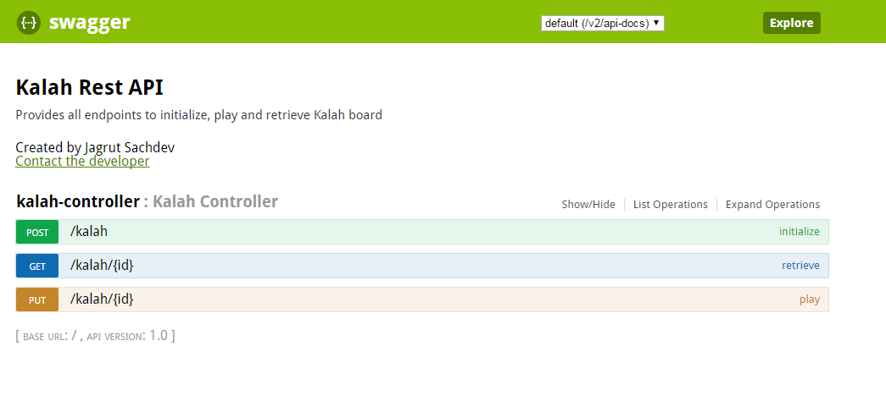

# kalah-rest

This is a spring boot based application to expose Rest APIs for Kalah.
It provides interfaces to initialize, retrieve and play the kalah board.

Detailed API documentation can be found using below url once application is deployed: 
http://localhost:8081/swagger-ui.html

It is also hosted on heroku. https://shrouded-lake-38768.herokuapp.com/swagger-ui.html/

This project is built using JDK 1.8 and uses:
- spring-boot
- spring-hateoas
- projectlombok
- springfox-swagger2
- springfox-swagger-ui

Run the jar file after build or use the one in target folder.
You can access the endpoints using http://localhost:8081/kalah after deployment.
Heroku endpoint https://shrouded-lake-38768.herokuapp.com/kalah/

Cheers!

